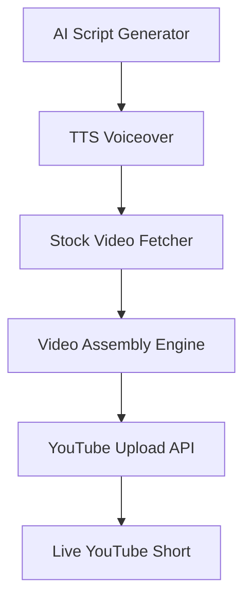

# 🎬 YouTube Shorts Automation Engine


A fully automated YouTube Shorts generation engine with AI-powered scripts, TTS narration, cinematic video assembly, SEO optimization, and auto-publishing via YouTube Data API v3. 🚀

## ✨ Features

- **✅ AI Script Generation**: Generates engaging, high-retention scripts using AI.
- **✅ Text-to-Speech (TTS)**: High-quality, natural-sounding voiceovers.
- **✅ Cinematic Video Assembly**: Automatically combines stock footage, audio, and text into a polished final video.
- **✅ SEO Optimization**: Generates optimized titles, descriptions, and tags.
- **✅ Auto-Publishing**: Directly uploads to YouTube via the Data API v3.
- **✅ Task Scheduling**: Run once, or schedule daily uploads via Windows Task Scheduler.

## 🏗️ Architecture



## 🛠️ Setup Instructions

1. **Clone the repository**:
   ```bash
   git clone https://github.com/ItzSaurav/youtube-shorts-automation.git
   cd youtube-shorts-automation
   ```

2. **Set up a virtual environment**:
   ```bash
   python -m venv .venv
   source .venv/bin/activate  # On Windows use: .venv\Scripts\activate
   ```

3. **Install dependencies**:
   ```bash
   pip install -r requirements.txt
   ```

4. **Environment Variables & Secrets**:
   - Create a `.env` file based on `.env.example` and add your API keys.
   - Place your `client_secrets.json` from Google Cloud Console into the project root for YouTube authentication.

## 🚀 Usage Guide

### Single Run
Execute the main script to generate and upload a single video:
```bash
python main.py
```

### Windows Task Scheduler
To run this automatically every day:
1. Open **Task Scheduler**.
2. Create a new Basic Task.
3. Set the trigger to **Daily**.
4. Set the action to **Start a program**.
5. Program/script: Path to your `.venv\Scripts\python.exe`.
6. Add arguments: Path to your `main.py` file.
7. Start in: The project root directory.

## 📸 Screenshots

*(Placeholder for future dashboard or sample video frames)*

## 📄 License

This project is licensed under the MIT License - see the [LICENSE](LICENSE) file for details.
